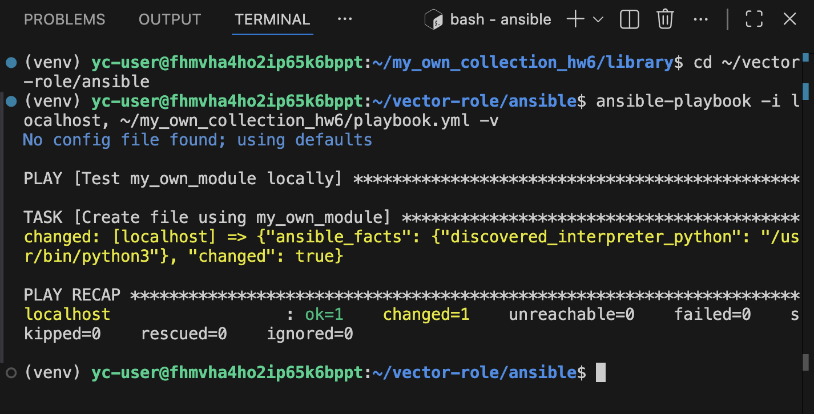
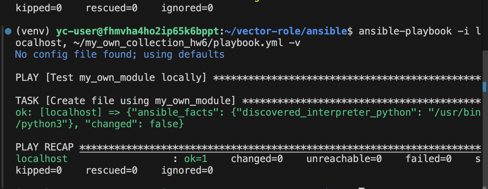
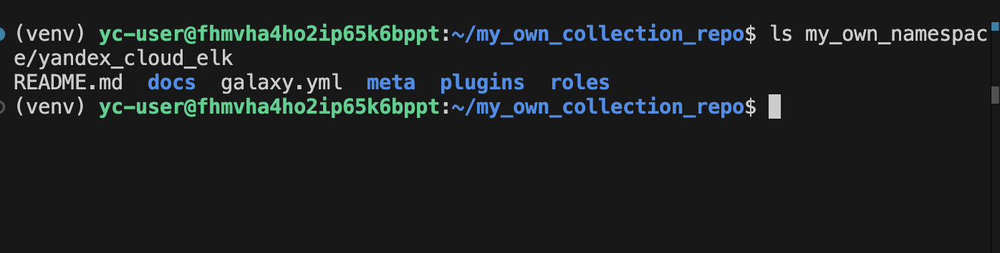
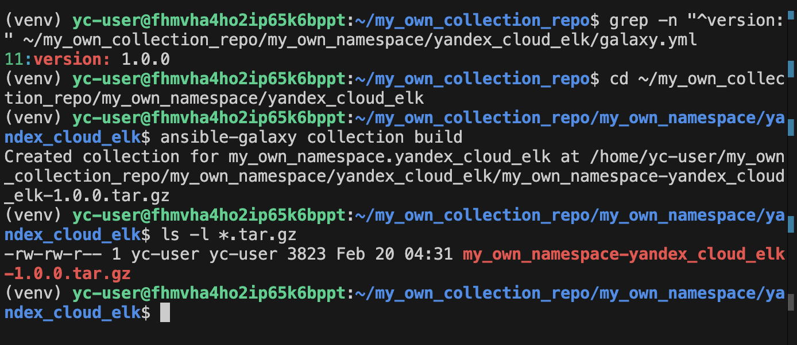
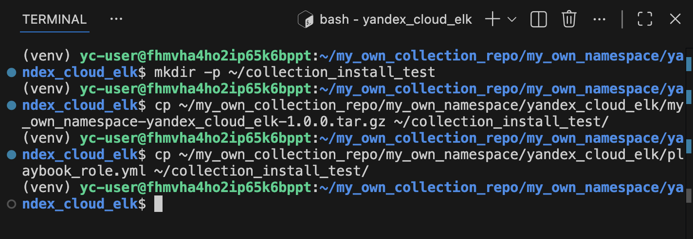
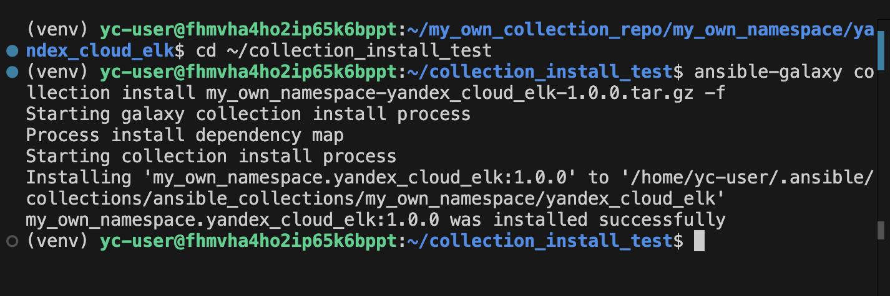
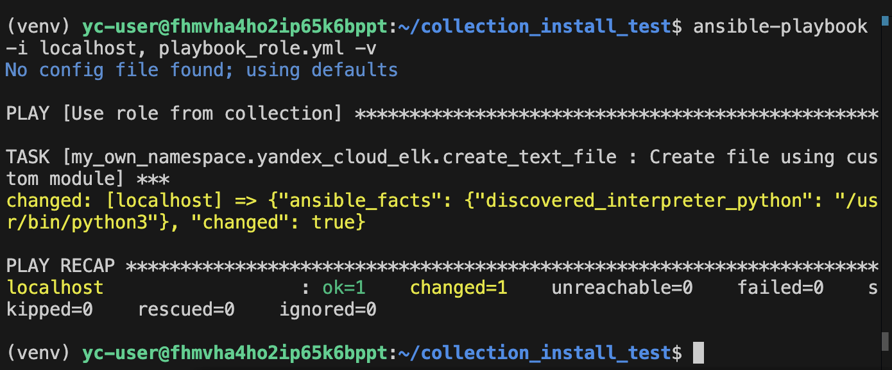
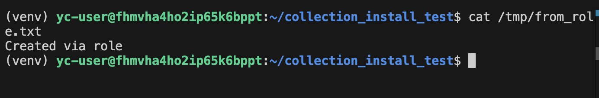

# my_own_namespace.yandex_cloud_elk

Учебная Ansible Collection для домашнего задания к занятию 6 «Создание собственных модулей».

## Что сделано в рамках задания

1. Написан собственный Ansible module `my_own_module`, который:
   - создаёт текстовый файл по пути `path`;
   - записывает в него содержимое `content`;
   - является идемпотентным (при повторном запуске не вносит изменений, если файл уже соответствует желаемому состоянию);
   - поддерживает `check_mode` (в режиме `--check` не меняет систему, но корректно сообщает `changed`).

2. Модуль упакован в Ansible Collection:
   - расположен в `plugins/modules/my_own_module.py`;
   - вызывается по FQCN: `my_own_namespace.yandex_cloud_elk.my_own_module`.

3. Создана role `create_text_file` внутри коллекции, которая вызывает модуль:
   - defaults заданы для всех параметров модуля (`path`, `content`);
   - основной task роли расположен в `roles/create_text_file/tasks/main.yml`.

4. Выполнена сборка архива коллекции:
   - `ansible-galaxy collection build` → `my_own_namespace-yandex_cloud_elk-1.0.0.tar.gz`

5. Выполнена установка коллекции из локального архива и проверочный запуск playbook.

## Состав коллекции

- `plugins/modules/my_own_module.py` — пользовательский модуль для создания/обновления текстового файла.
- `roles/create_text_file/` — роль, использующая модуль.
- `playbook_role.yml` — пример playbook для запуска роли.

## Требования

- Ansible Core 2.16.x
- Python 3.10+ (контроллер)
- Linux (проверено на Ubuntu 22.04)

## Установка (из локального архива)

В каталоге с архивом:

```bash
ansible-galaxy collection install my_own_namespace-yandex_cloud_elk-1.0.0.tar.gz -f
```

















